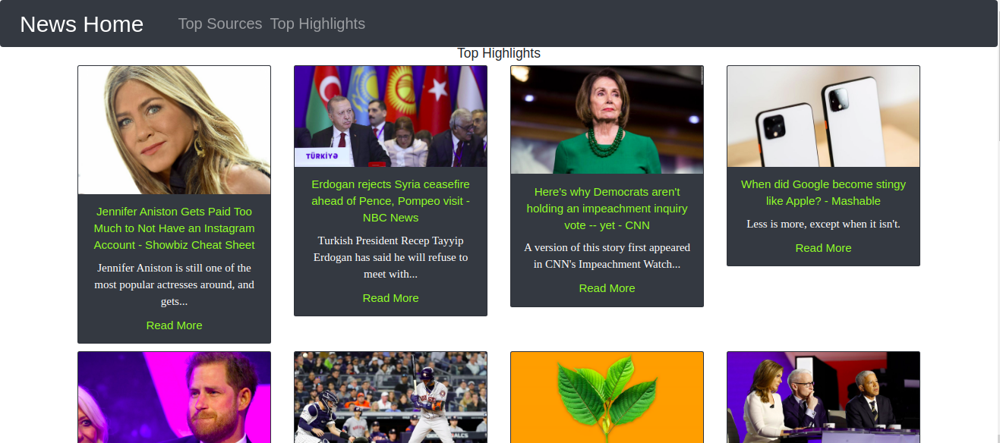

# News Highlight application - Flask

####  A News Highlights application.

## Author
[James Ngari](https://github.com/Jay-68)

## Description
Application makes use of the news database API

## Features
Here are the features in summary:
* App displays most popular news sources in the US.
* User can also view the top highlights from the top sources.

## Requirements
* This program requires python3.+ (and pip) installed, a guide on how to install python on various platforms can be found [here](https://www.python.org/)

## Installation and Set-up
To view the app, open the live site link provided below on the README.
Here is a run through of how to set up the application:
* **Step 1** : Clone this repository using **`git clone https://github.com/Jay-68/news-highlight`**, or downloading a ZIP file of the code.
* **Step 2** : The repository, if downloaded as a .zip file will need to be extracted to your preferred location and opened
* **Step 3** : Go to the project root directory and install the virtualenv library using pip an afterwards create a virtual environment. Run the following commands respectively:
    * **`pip install virtualenv`**
    * **`virtualenv venv`**
    * **`source virtual/bin/activate`**
        * Note that you can exit the virtual environment by running the command **`deactivate`**
* **Step 4** : Download the all dependencies in the requirements.txt using **`pip install <name>`**
* **Step 5** : Go to the [news API]() WEBSITE, sign up for a free account and generate an API key. 
    * Create a file in your root directory called start.sh and store the API key like so **`export API_KEY="<your-key>"`**
    * On the same file write down the command **`python3 manage.py server`** 
* **Step 6** : On your terminal, run the following command, **`chmod a+x start.sh`**
    * You can now launch the application locally by running the command **`./start.sh`** 
    * Open your preferred browser and view the app by opening the link **http://127.0.0.1:5000/**.

## Technologies Used
* Python 3.7.4
* Flask 1.1.1
* HTML
* CSS
* Bootstrap 4

## Support and contact details
You can provide feedback or raise any issues/ bugs through the following means:
* ngari.james.n@gmail.com

## Live Site link
You can view the live application by following this [link](https://calm-taiga-29949.herokuapp.com/sources).

## License
#### MIT Licence
